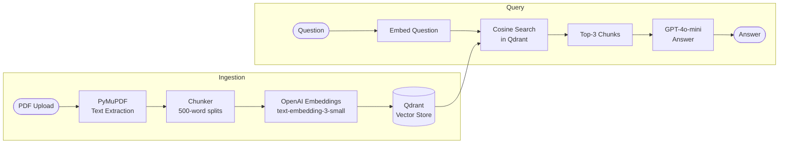

# n8n RAG Pipeline

> Minimal, production-ready RAG backend — FastAPI + Qdrant + OpenAI. Upload a PDF, ask questions, get grounded answers. Built to be called from n8n workflows.

## How It Works



## API

| Method | Endpoint | Description |
|---|---|---|
| POST | `/ingest` | Upload PDF → chunk → embed → store in Qdrant |
| POST | `/query` | Question → semantic search → GPT-grounded answer |

```bash
# Ingest
curl -X POST http://localhost:8000/ingest -F "file=@document.pdf"

# Query
curl -X POST http://localhost:8000/query \
  -H "Content-Type: application/json" \
  -d '{"question": "What are the key clauses?"}'
```

## Core Implementation

**`ingest.py` — PDFIngester class:**
```python
def load_text()               # PyMuPDF full-text extraction
def chunk_text(text)          # 500-word word-boundary splits
def embed_and_store(chunks)   # OpenAI embed → Qdrant upsert
def query_collection(q)       # Semantic search → GPT-4o-mini answer
```

## Stack

| Component | Technology |
|---|---|
| API | FastAPI |
| PDF parsing | PyMuPDF |
| Embeddings | OpenAI text-embedding-3-small (1536-dim) |
| Vector DB | Qdrant (cosine similarity) |
| LLM | OpenAI GPT-4o-mini |

## Setup

```bash
cp .env.example .env   # set OPENAI_API_KEY, QDRANT_HOST, QDRANT_PORT
pip install fastapi uvicorn pymupdf openai qdrant-client python-dotenv python-multipart
docker run -p 6333:6333 qdrant/qdrant
uvicorn main:app --reload
```

API docs: `http://localhost:8000/docs`

## Connecting to n8n

1. **HTTP Request** node → `POST /ingest` with PDF binary
2. **HTTP Request** node → `POST /query` with `{"question": "{{$json.question}}"}`
3. Wire to any trigger — Webhook, Schedule, Google Form

## Environment

```bash
OPENAI_API_KEY=
QDRANT_HOST=localhost
QDRANT_PORT=6333
```
